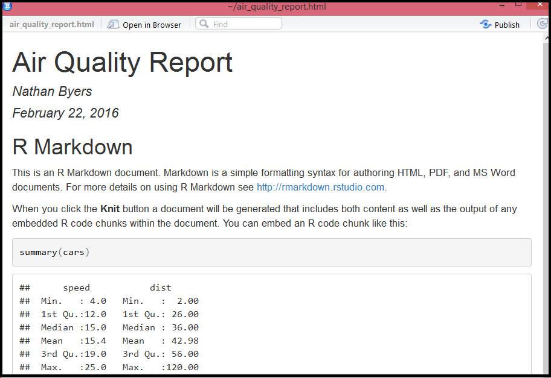

R Markdown is a platform developed by RStudio for creating dynamic documents.
Using the R Markdown syntax, you can create HTML, PDF, and Word documents. You 
can also make slide presentations. See RStudio's site for full documentation:
[rmarkdown.rstudio.com](http://rmarkdown.rstudio.com/).

This tutorial covers the following topics:

- [Getting started](#start)

- [Basic syntax](#syntax)

- [Choosing an output](#output)

## Getting started {#start}

Starting an R Markdown document is very easy. You can click on the document
icon in RStudio in the upper left hand corner.


Choose R Markdown.


You can then enter information about the title, the author, and the output
format.


Once you click OK, there will be a new document in the top left panel of RStudio
with some pre-populated information.


The information at the very top between the triple dashes is called the header.
That is information that determines how the document will be rendered. You can 
edit the title, author, and date directly in the header. However, if you change
any of the formatting, or change other information, it might break the document.

To render this document in HTML, click on the "Knit HTML" button.


Provide a file name for the document and save it.


RStudio will knit everything together and render the HTML in a window.




## Basic syntax {#syntax}

Markdown is a simple way to add formatting, like headers and bulleted lists, to
to text. It's an alternative to a mark-up language such as HTML. R Markdown is
a version of markdown that allows you to integrate R code and output with text.

Below is some basic syntax for formatting a document.

#### Emphasis
```
*italic*  **bold**
  
_italic_  __bold__
```

#### Headers
```
# Header 1

## Header 2

### Header 3
```

#### Lists
```
- Item 1
- Item 2
    + Item 2a
    + Item 2b

1. Item 1
2. Item 2
    + Item 2a
    + Item 2b
```

#### R code and output


## Choosing an output {#output}

R Markdown can be rendered as an HTML page in a web browser. You can also choose 
Word or PDF as an output.


To compile a PDF document, you must first install Tex on your system. Go to 
the MikTex website to download and install the necessary software:
[miktek.org/download](http://miktex.org/download). 

You can also make presentation slides using R Markdown. Select the Presentation
option when opening a new R Markdown document.


## Further reading

